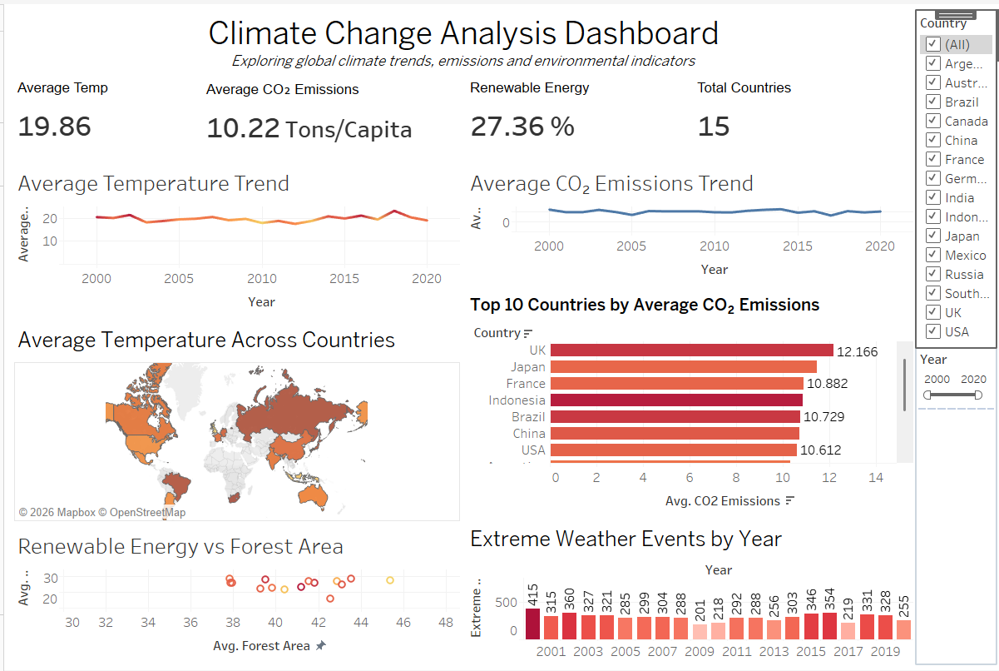

# 🌍 Climate Change Analysis Dashboard

An interactive Tableau dashboard developed to analyze climate-related trends across countries and years. The dashboard focuses on temperature, CO₂ emissions, renewable energy, forest area, and extreme weather events.

## 📌 Project Overview

Climate change involves multiple environmental indicators that can be difficult to analyze using raw datasets.

This project uses Tableau to transform climate data into interactive visualizations that help users explore trends, compare countries, and identify patterns in environmental indicators.

## 🎯 Objectives

- Analyze average temperature trends over time
- Compare CO₂ emissions across countries
- Explore renewable energy and forest area
- Analyze extreme weather events by year
- Provide interactive country and year filters
- Present climate information through an easy-to-understand dashboard

## 📊 Dataset

The dataset contains climate-related information for multiple countries and years.

### Key Columns

| Column | Description |
|---|---|
| Year | Year of observation |
| Country | Country name |
| Avg Temperature | Average temperature in °C |
| CO₂ Emissions | CO₂ emissions in tons per capita |
| Sea Level Rise | Sea level rise in mm |
| Rainfall | Rainfall measurement in mm |
| Population | Population |
| Renewable Energy | Renewable energy percentage |
| Extreme Weather Events | Number of extreme weather events |
| Forest Area | Forest area percentage |

## 🧹 Data Cleaning

The dataset was prepared using Microsoft Excel before importing it into Tableau.

The following preprocessing steps were performed:

- Checked for missing values
- Removed duplicate records
- Verified data types
- Standardized column names
- Checked numerical values
- Checked consistency of country names
- Removed unnecessary spaces and formatting issues

## 📈 Dashboard Visualizations

The dashboard contains the following visualizations:

### KPI Cards
- Average Temperature
- Average CO₂ Emissions
- Average Renewable Energy
- Total Countries

### Charts

- Average Temperature Trend
- Average CO₂ Emissions Trend
- Average Temperature by Country
- Top 10 Countries by Average CO₂ Emissions
- Renewable Energy vs Forest Area
- Extreme Weather Events by Year

## 🎛️ Interactivity

The dashboard allows users to:

- Filter the data by country
- Select a year range
- Click countries on the map to filter the dashboard
- Interact with charts to explore specific data points
- Dynamically update KPI values and visualizations

## 🔍 Key Insights

- Average temperature shows year-to-year fluctuations across the selected period.
- CO₂ emissions vary across countries and years.
- The dataset shows differences in average per-capita CO₂ emissions between countries.
- Extreme weather events vary considerably across different years.
- The scatter plot helps explore the relationship between renewable energy usage and forest area.

## 🛠️ Tools & Technologies

- Tableau
- Microsoft Excel
- Data Visualization
- Data Analysis

## 📷 Dashboard Preview

## 📁 Project Files

- `Climate_Change_Analysis_Dashboard.twbx` — Tableau packaged workbook
- `Climate_Change_Cleaned.csv` — Cleaned dataset
- `climate_dashboard.png` — Dashboard preview

## 🎓 Skills Demonstrated

- Data Cleaning
- Exploratory Data Analysis
- Data Visualization
- Tableau Dashboard Development
- Interactive Dashboard Design
- KPI Development
- Geographic Visualization
- Trend Analysis
- Data Interpretation

## 👩‍💻 Author

**Karthika R**

BE Computer Science & Engineering (Data Science)
